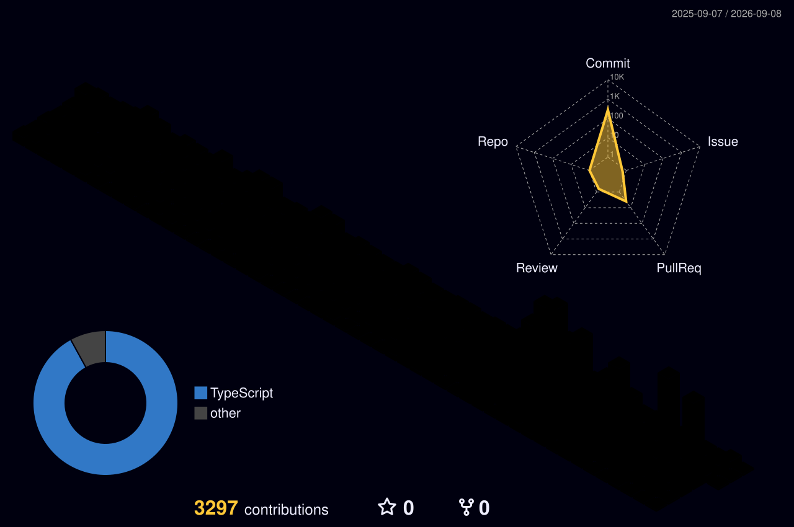
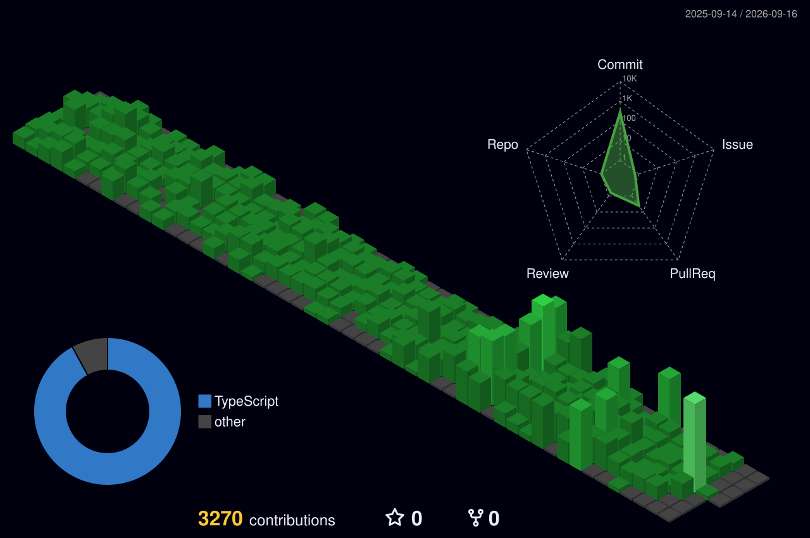
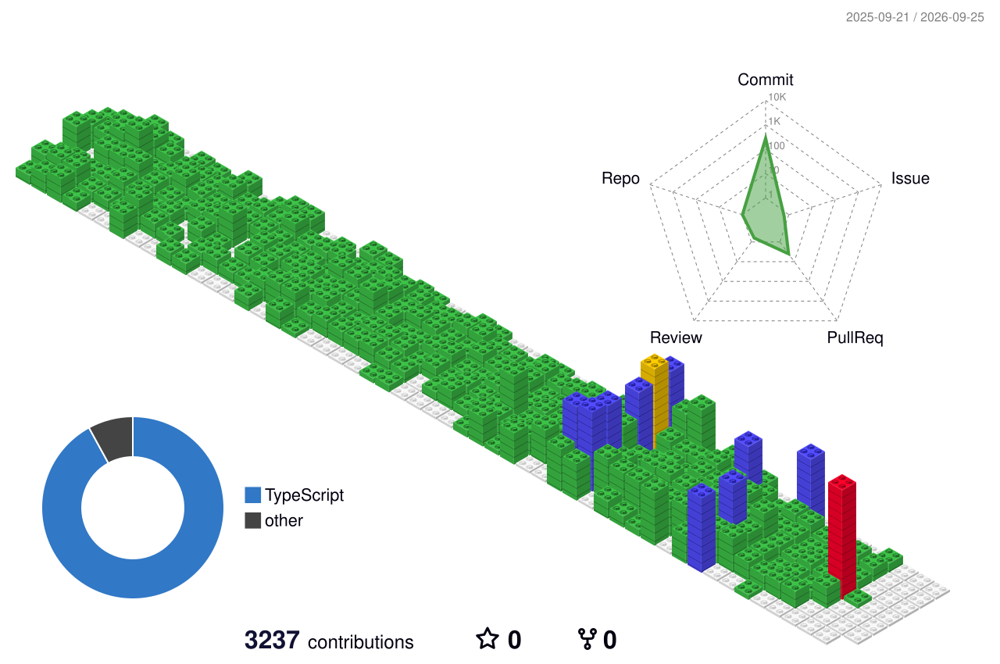
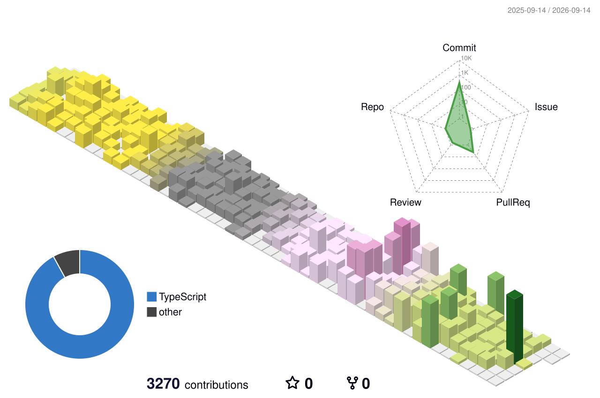

# 👋 Hey there, I'm Jad!
### 🚀 Software Architect • Full-Stack Engineer • Cloud Systems Builder

  

  
  
  

---

### 🏆 GitHub Profile Trophies & Achievements

  

---

### 📊 Performance & Consistency Metrics

  <!-- Card 1: Consistency & Activity Streak -->
  

  <!-- Card 2: Profile Velocity & Summary Details (Exact Matching Dimensions) -->
  

---

### 📈 Dynamic 3D Contribution Skyline

  

<!-- Interactive Dynamic Perspective Switcher -->

  
<b>🔍 Click to switch 3D skyline perspectives &amp; themes</b>

   

  

    <b>🌌 Night Green Matrix View:</b> 
    
  

  

    <b>🧱 Isometric GitBlock Grid View:</b> 
    
  

  

    <b>🍂 Seasonal Animated Growth View:</b> 
    
  

---

### 🐍 Live Contribution Activity Grid

  

---

### 🛠️ Tech Stack & Engineering Toolkit

  <!-- Languages -->
  
  
  
  
  
   
  <!-- Frameworks & Backend -->
  
  
  
  
  
   
  <!-- Cloud & DevOps -->
  
  
  
  
  
  

---

  

